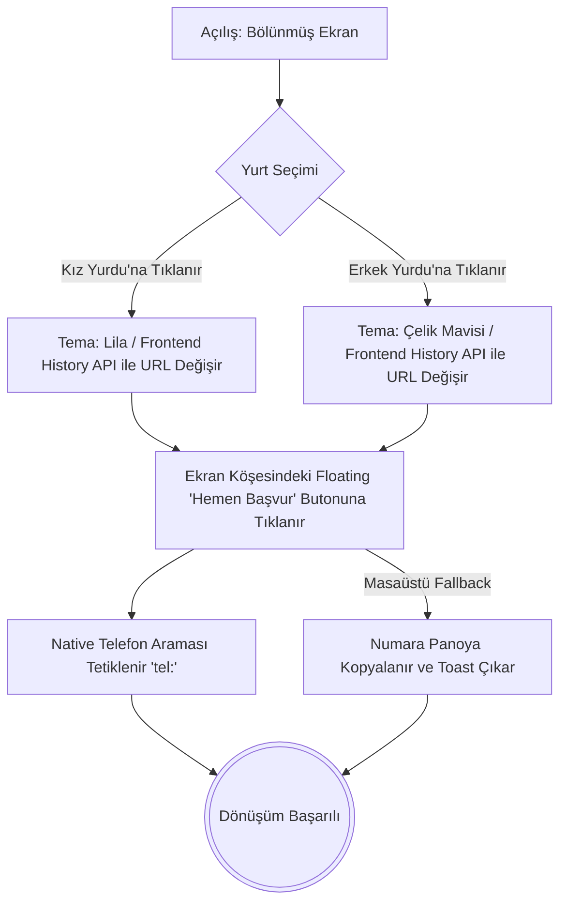
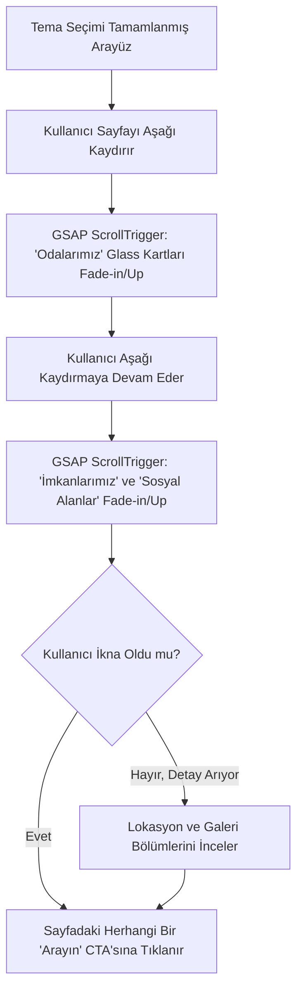
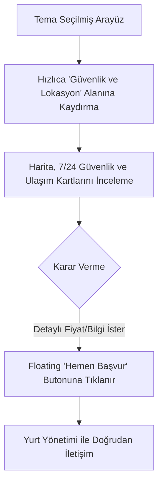

# UX Design Specification akademi_yurt

**Author:** Emrekolunsag
**Date:** 2026-04-24

---

## Yönetici Özeti (Executive Summary)

### Proje Vizyonu (Project Vision)
Akademi Suit, Sivas'taki premium öğrenci konaklama sektöründe dijital standartları yeniden belirlemeyi hedefleyen yenilikçi bir web platformudur. Standart ve eski moda yurt sitelerinin aksine; karmaşık menülerden, uzun kayıt formlarından ve WhatsApp mesajlaşmalarından arındırılmış, doğrudan etkileşimi (telefon araması) merkeze alan hedefe odaklı bir strateji benimser. "Bölünmüş Ekran (Split-Screen)" mimarisiyle kullanıcıları anında Kız veya Erkek yurdu deneyimlerine yönlendirerek kişiselleştirilmiş bir arayüz sunar. GSAP tabanlı akıcı mikro-animasyonlar ve Glassmorphism tasarım detayları kullanılarak kullanıcılara sıradan bir yurt sitesinden ziyade "üst düzey butik otel" hissiyatı yaşatmayı amaçlar.

### Hedef Kullanıcılar (Target Users)
1. **Üniversite Öğrencileri (Gen-Z):** Birincil kullanıcı grubudur. Hızlı karar veren, görselliğe önem veren, modern ve rahat bir yaşam alanı arayan, teknolojiye hakim ve estetik beklentileri yüksek kitle.
2. **Ebeveynler:** İkincil ama karar verici konumundaki kullanıcı grubudur. Güvenlik, kalite, şeffaflık ve profesyonel iletişim arayan kitle. Karmaşık olmayan, net bilgi sunan, yüksek kontrastlı ve okunabilir tasarımlara ihtiyaç duyarlar.

### Temel Tasarım Zorlukları (Key Design Challenges)
- **Performans vs. Görsellik:** "Wow" faktörünü sağlayan akıcı GSAP animasyonlarının (60 FPS hedefiyle), eski cihazlarda performansı düşürmesini engellemek (Progressive Enhancement/Fallback stratejisi).
- **Okunabilirlik (Kontrast):** Yarı saydam Glassmorphism kart tasarımlarının özellikle ebeveynler (ikincil kullanıcılar) tarafından tüm mobil cihaz ekranlarında (WCAG AA, minimum 4.5:1 kontrast) rahatça okunabilmesini sağlamak.
- **Kesintisiz Gezinme (Seamless Navigation):** Bölünmüş ekran (Split-Screen) sonrasında URL tabanlı tema geçişlerinin (Kız/Erkek yurdu) kullanıcıyı kaybolmuş hissettirmeden akıcı bir şekilde gerçekleşmesini sağlamak.

### Tasarım Fırsatları (Design Opportunities)
- **Bölünmüş Ana Ekran (Split-Screen) Etkisi:** Kullanıcı siteye girdiği anda dikkat çeken bu cesur giriş, projenin rakiplerinden anında ayrışmasını ve akılda kalıcı bir marka kimliği oluşturmasını sağlar.
- **Premium Estetik (Butik Otel Hissi):** Klasikleşmiş CSS framework'lerinin (Tailwind/Bootstrap vb.) getirdiği standart görünümler yerine, Vanilla CSS ile oluşturulmuş özel değişkenlerle benzersiz bir görsel dil oluşturmak.
- **Sürtünmesiz Dönüşüm (Frictionless Conversion):** Her türlü form ve karmaşanın kaldırılarak, yalnızca "Hemen Başvur (Apply Now)" butonlarına odaklanılması, dönüşüm hunisini en aza indirerek başarı şansını ciddi şekilde artırır.

## Temel Kullanıcı Deneyimi (Core User Experience)

### Deneyimi Tanımlama (Defining Experience)
Kullanıcıların en sık ve kritik olarak yapacakları eylem; siteye ilk girişte kendi hedef kitlelerine uygun yurdu (Kız veya Erkek) seçerek, kendileri için özelleştirilmiş odaları/imkanları incelemek ve ardından doğrudan "Hemen Başvur (Apply Now)" butonuna tıklayarak telefon araması başlatmaktır. Tüm deneyim bu "Giriş -> Keşfet -> Ara" (Entry -> Discover -> Call) döngüsünün pürüzsüz ve "wow" dedirten bir hızda gerçekleşmesi üzerine kuruludur.

### Platform Stratejisi (Platform Strategy)
Uygulama tamamen web tabanlı (Web App / MPA) çalışacaktır. Öncelikli olarak mobil cihazlar (dokunmatik) gözetilerek tasarlanacaktır, çünkü hedef kitle olan Gen-Z'nin ve ebeveynlerin büyük çoğunluğu siteyi telefonlarından ziyaret edecektir. Ancak masaüstünde de premium hissi verecek şekilde ölçeklenecektir. Yüksek performans gerektiren GSAP animasyonları kullanılacağından, düşük donanımlı cihazlarda (prefers-reduced-motion veya donanım kısıtlamalarında) "Progressive Enhancement" stratejisi uygulanarak animasyonlar hafifletilecek veya tamamen kapatılacaktır.

### Pürüzsüz Etkileşimler (Effortless Interactions)
Kullanıcılar için hiçbir efor gerektirmemesi gereken noktalar şunlardır:
- Ana sayfadaki Kız/Erkek seçimi sonrası uygulamanın tüm renk ve tema bağlamının (URL parametreleri üzerinden) anında ve hatasız dönüşmesi.
- Herhangi bir form doldurma zorunluluğu, kişisel veri girme veya onay bekleme süreci olmadan tek tıkla doğrudan telefon uygulamasının (`tel:`) açılması.
- Yarı saydam (Glassmorphism) menülerin ve arayüz elemanlarının, gezinme esnasında kullanıcının okuma hızını veya parmak hareketlerini engellemeyecek şekilde doğal hissettirmesi.

### Kritik Başarı Anları (Critical Success Moments)
- **İlk Karşılaşma (First Impression):** Sitenin yüklendiği ilk saniye. Dinamik "Split-Screen" (Bölünmüş Ekran) animasyonunun akıcı bir şekilde çalışarak kullanıcıyı şaşırtması ve kalite algısını anında oluşturması.
- **Hedefe Ulaşma:** "Hemen Başvur" butonunun ekranın en doğru yerinde (ve her sayfada erişilebilir) olması ve tıklanıldığı anda gecikmesiz aksiyon alması. Bu anın başarısızlığı veya kafa karıştırıcı bir iletişim sayfasına yönlendirmesi, projenin temel dönüşüm hedefini zedeler.

### Deneyim Prensipleri (Experience Principles)
Tüm UX kararlarımızı şekillendirecek temel ilkeler şunlardır:
1. **Karmaşadan Ziyade Netlik:** Sınırsız menü seçenekleri yerine, doğrudan hedef kitleye özel içeriği öne çıkar.
2. **Form Değil Aksiyon (Sürtünmesiz Dönüşüm):** Kullanıcıyı formlarla yorma; tek tıkla canlı telefon bağlantısına yönlendir.
3. **Performanslı Estetik:** "Wow" faktörü yaratan GSAP animasyonları şarttır, ancak hız ve erişilebilirlikten asla taviz verilemez.
4. **Güven Veren Şeffaflık:** Özellikle ebeveynler için Glassmorphism ve premium tasarım öğeleriyle profesyonel "butik otel" algısını koru.

## İstenen Duygusal Yanıt (Desired Emotional Response)

### Birincil Duygusal Hedefler (Primary Emotional Goals)
**Gen-Z Öğrenciler İçin:** "Wow" etkisi, özel hissetme ve heyecan. Siteye girdikleri an premium bir deneyim yaşadıklarını ve "tam da aradıkları o butik, modern yer" olduğunu hissetmeliler.
**Ebeveynler İçin:** Güven, şeffaflık ve rahatlama. Çocuklarını emanet edecekleri bu kurumun dijitaldeki profesyonel duruşu, fiziksel kalitenin ve güvenliğin doğrudan bir yansıması olarak algılanmalı.

### Duygusal Yolculuk Haritası (Emotional Journey Mapping)
- **İlk Keşif (First Discovery):** Karşılarına çıkan dinamik "Bölünmüş Ekran (Split-Screen)" animasyonuyla şaşkınlık ve merak (Sıradan bir yurt sitesi beklentisinin kırılması).
- **Keşif Evresi (Exploration):** Kendi hedeflerine (Kız/Erkek) tıkladıklarında, renk paletinin uyumlanmasıyla hissettikleri "aidiyet" ve yüksek kontrastlı cam efektli (Glassmorphism) içerikleri okurken yaşadıkları "akıcılık".
- **Dönüşüm Anı (Conversion/Call):** Herhangi bir uzun formu doldurma zahmetine girmeden, "Hemen Başvur" butonuna tıkladıklarında yaşanan "zahmetsizlik" hissi ve doğrudan kurumsal bir sesle konuştuklarında hissedilen "güven".

### Mikro-Duygular (Micro-Emotions)
- Kafa karışıklığı (Confusion) yerine **Netlik (Clarity)**: Karmaşık menülerin olmaması.
- Şüphe (Skepticism) yerine **Güven (Trust)**: Şeffaf iletişim ve premium butonlar.
- Sıkıntı (Boredom) yerine **Heyecan (Excitement)**: Her tıklamada ve scroll hareketinde GSAP mikro-animasyonlarıyla gelen sürprizler.
- Bekleme stresi (Anxiety) yerine **Anında Aksiyon (Accomplishment)**: Forma veri girmek yerine, anında `tel:` bağlantısı ile konuşmaya başlama.

### Tasarım Çıkarımları (Design Implications)
- **Wow Etkisi →** Bölünmüş ekran açılışı ve sayfa içi ScrollTrigger animasyonlarına öncelik ver. Butik otel hissini Vanilla CSS Tasarım Sistemi ile standartlaştır.
- **Güven ve Netlik →** Veliler için okunabilirliği en üst düzeyde tut; Glassmorphism efektlerinde kontrast oranını (minimum 4.5:1 WCAG AA) koru. CTA butonlarını ("Hemen Başvur") her sayfada görünür ve tek tıkla çalışır kıl.
- **Zahmetsizlik →** Sayfalar arası geçişlerde URL (Route) tabanlı tema yönetimi kullan; kullanıcıyı yoran her türlü giriş, form veya mesajlaşma adımını tamamen kaldır.

### Duygusal Tasarım Prensipleri (Emotional Design Principles)
1. **İlham Ver ve Güven Aşıla:** Öğrenciyi dinamizmle yakala, ebeveyni profesyonellik ve sadelikle ikna et.
2. **Sürpriz Yap Ama Yorma:** Animasyonlar büyüleyici olmalı, ancak kullanıcının aradığı bilgiye (veya arama butonuna) ulaşmasını asla geciktirmemeli.
3. **Mikro Etkileşimlerle Ödüllendir:** Hover efektleri, tıklama tepkileri ve scroll animasyonları ile kullanıcıya her adımda tatmin edici geri bildirimler sun.

## UX Desen Analizi ve İlham (UX Pattern Analysis & Inspiration)

### İlham Veren Ürün Analizi (Inspiring Products Analysis)
- **Premium Butik Otel Siteleri:** Görsel ağırlıklı, az metinle çok şey anlatan ve kullanıcılara doğrudan lüks/rahatlık hissiyatı veren yapılar.
- **Apple (Ürün Tanıtım Sayfaları):** GSAP ve ScrollTrigger benzeri kaydırma tabanlı (scroll-based) hikaye anlatımı, donanımsal ivmelenme ile sağlanan inanılmaz akıcılık ve kusursuz Glassmorphism (cam efekti) kullanımı.
- **Airbnb (Minimalist Dönüşüm):** Gereksiz formların ve karmaşık adımların olmadığı, doğrudan kaliteli görsellerin ve hızlı aksiyonun (rezervasyon/iletişim) ön planda olduğu temiz arayüz.

### Aktarılabilir UX Desenleri (Transferable UX Patterns)
- **Bölünmüş Ekran (Split-Screen) Seçimi:** Kullanıcıya anında kişiselleştirilmiş bir seçenek (Kız/Erkek Yurdu) sunarak klasik menü yükünü ortadan kaldırmak.
- **Glassmorphism:** Modern ve ferah bir yüzey (Surface) üzerine yerleştirilmiş yarı saydam kartlar ile derinlik (depth) hissi yaratmak ve premium algısını desteklemek.
- **Sabit (Floating) CTA Butonu:** Ekran ne kadar kaydırılırsa kaydırılsın, kullanıcının göz hizasında her zaman "Hemen Başvur" butonuna erişebilmesi.

### Kaçınılması Gereken Anti-Desenler (Anti-Patterns to Avoid)
- **Uzun ve Sıkıcı İletişim Formları:** Kullanıcıları veri girmeye zorlayan ve sürtünme yaratarak dönüşüm (conversion) oranını düşüren geleneksel web formları.
- **Kapatılamayan / Engelleyici WhatsApp Widget'ları:** Arayüzün önemli kısımlarını kaplayan, mobil ekranın alt köşesinde sürekli dikkat dağıtan hazır sohbet/WhatsApp eklentileri.
- **Performans Düşmanı (Janky) Animasyonlar:** Mobil cihazlarda donmalara neden olan, ekranı kilitleyen veya sayfayı aşağı kaydırmayı (scroll hijacking) zorlaştıran optimize edilmemiş animasyonlar.

### Tasarım İlham Stratejisi (Design Inspiration Strategy)
- **Neleri Benimseyeceğiz (What to Adopt):** GSAP ile akıcı scroll animasyonları, yüksek kontrastlı Glassmorphism kart tasarımları, pürüzsüz `tel:` bağlantılı CTA butonları.
- **Neleri Uyarlayacağız (What to Adapt):** Butik otel sitelerindeki o ağırbaşlı lüksü, Gen-Z'nin dinamik beklentileriyle (canlı Lilac ve Steel Blue renk temalarıyla) birleştirerek öğrenci yurdu konseptine uyarlayacağız.
- **Nelerden Kaçınacağız (What to Avoid):** Tailwind gibi standart hazır sınıfların yarattığı "jenerik" tasarımlardan ve kullanıcıyı eyleme geçmekten oyalayan her türlü ara katmandan (formlar vb.) kaçınacağız.

## Tasarım Sistemi Temeli (Design System Foundation)

### Tasarım Sistemi Seçimi (Design System Choice)
**Özel Tasarım Sistemi (Custom Design System - Vanilla CSS):** Projenin katı kuralları gereği Tailwind, Bootstrap, MUI gibi hazır CSS framework'leri veya kütüphaneleri KESİNLİKLE kullanılmayacaktır. Tüm arayüz, `:root` üzerinde CSS değişkenleriyle (tokens) tanımlanmış tamamen özel ve sıfırdan yazılmış bir Vanilla CSS mimarisi üzerine inşa edilecektir.

### Seçim Gerekçesi (Rationale for Selection)
- **Görsel Özgünlük (Uniqueness):** Hazır CSS kütüphanelerinin getirdiği "jenerik" görünümden kaçınarak, "butik otel" lüksünü ve markanın eşsiz kimliğini tam olarak yansıtmak.
- **Erişilebilirlik ve Kontrol:** Yarı saydam Glassmorphism kartlarındaki bulanıklık (blur) ve metin kontrast oranları (WCAG AA 4.5:1) üzerinde %100 kontrol sağlamak.
- **Pürüzsüz GSAP Entegrasyonu:** Projenin kalbi olan "Split-Screen" ve ScrollTrigger animasyonlarını, DOM üzerinde gereksiz/kalabalık utility (yardımcı) sınıflar barındırmayan temiz bir CSS yapısıyla performanslı bir şekilde yönetmek.

### Uygulama Yaklaşımı (Implementation Approach)
- **Tasarım Token'ları:** Tüm marka renkleri (Lilac, Steel Blue vb.), tipografi (Google Fonts: Epilogue, Inter, Montserrat), boşluklar (spacing) ve katman (z-index) değerleri global `var(--isim)` token'ları olarak tanımlanacaktır.
- **Semantik Sınıf İsimlendirme:** `.flex`, `.pt-4` gibi utility sınıflar yerine `.hero-split-screen`, `.glass-card-container` gibi işlevi net olarak anlatan semantik sınıf adlandırmaları kullanılacaktır.
- **Bileşen Bazlı Mimari:** Tekrarlayan UI parçaları (Header, Footer, Yurt Kartları), Vanilla JS modülleri veya Handlebars (MPA) partial'ları aracılığıyla kapsüllenmiş (encapsulated) olarak geliştirilecektir.

### Özelleştirme Stratejisi (Customization Strategy)
- **URL-First Tema Yönetimi:** Kullanıcı Kız veya Erkek yurdu seçtiğinde, sitenin genel renk ve bağlam teması geçici bir JS durumu (state) ile değil, doğrudan URL üzerinden yönetilecektir. Sayfa, URL'ye göre ilgili CSS `:root` değişkenlerini güncelleyerek (Theme Switching) tüm Glassmorphism kartlarının ve arka planların anında hedeflenen yurdun kimliğine bürünmesini sağlayacaktır.

## 2. Çekirdek Kullanıcı Deneyimi (Core User Experience Details)

### 2.1 Deneyimi Tanımlayan Etkileşim (Defining Experience)
Projeyi eşsiz kılan ve "Eğer bunu kusursuz yaparsak her şey çözülür" dediğimiz o tek etkileşim: **"Bölünmüş Ekran (Split-Screen) Seçimi ve Anında Tematik Dönüşüm"**dür. Kullanıcı siteye girdiği an devasa ve sıkıcı bir menüyle boğuşmaz; ekranın solunda Kız Yurdu, sağında Erkek Yurdu görseliyle karşılaşır. Yapacağı tek bir tıklama, tüm arayüzün akıcı bir GSAP animasyonuyla tamamen kendi dünyasına (özel renk paleti ve içerik) dönüşmesini sağlar.

### 2.2 Kullanıcı Zihinsel Modeli (User Mental Model)
- **Mevcut Model:** Standart yurt sitelerinde kullanıcılar "Hakkımızda", "Odalar", "İletişim" gibi klasik üst menüler (navbar) arasında gezinerek kendilerine uygun içeriği bulmaya çalışırlar. Bilgiye ulaşmak zordur ve iletişim genellikle yorucu formlar üzerinden yürür.
- **Yeni Model (Bizim Yaklaşımımız):** Kullanıcı siteye girdiği an bir "kimlik" seçer (Kız/Erkek). Tıpkı bir butik otele adım atmış gibi, sistem anında kullanıcının önüne ona özel odayı ve imkanları serer. Modern bir mobil uygulama gibi, tek bir yön ve tek bir hedef vardır: İncele ve Ara.

### 2.3 Başarı Kriterleri (Success Criteria)
- Ziyaretçiler siteye girdiğinde ilk 2 saniye içinde tereddüt etmeden "Kız Yurdu" veya "Erkek Yurdu" seçeneklerinden birine tıklar.
- Tıklama anında gerçekleşen ekran kaplama (expansion) animasyonunda hiçbir donma (jank) veya kare hızı (FPS) düşüşü yaşanmaz.
- Sayfanın her yerinden erişilebilen sabit "Hemen Başvur" butonuna tıklandığında, cihazın yerleşik telefon arama ekranı (`tel:`) anında ve gecikmesiz açılır.

### 2.4 Özgün UX Desenleri (Novel UX Patterns)
- **Bölünmüş Ekran (Split-Screen) Açılışı:** Öğrenci konaklama sektöründe neredeyse hiç görülmeyen, daha çok premium moda markalarında veya interaktif portföylerde rastlanan, merak uyandırıcı bir desendir.
- **Kavranabilirlik (Intuitive Design):** Masaüstünde hover (fare ile üzerine gelme) ile seçili alanın hafifçe büyümesi, mobilde ise büyük ve net tipografi kullanımı; kullanıcının arayüzü nasıl kullanacağını içgüdüsel olarak anlamasını sağlar.

### 2.5 Etkileşim Mekaniği (Experience Mechanics)
1. **Başlangıç (Initiation):** Sayfa yüklenir. Ekran eşit olarak ikiye bölünmüştür (Mobilde altlı-üstlü). Sol taraf Lila (Kız), sağ taraf Çelik Mavisi (Erkek) ağırlıklıdır.
2. **Etkileşim (Interaction):** Kullanıcı kendi ilgilendiği tarafa tıklar (veya dokunur).
3. **Geri Bildirim (Feedback):** Tıklanan bölüm ekranı akıcı bir şekilde kaplar (GSAP scale/flex-grow animasyonu). URL parametresi anında değişir ve yeni temanın CSS değişkenleri (`:root`) devreye girer. İçerik (Glassmorphism kartlar, odalar) yumuşak bir fade-in ile ekrana yerleşir.
4. **Tamamlama (Completion):** Kullanıcı zahmetsizce odayı inceler ve ikna olduğu an ekranın köşesinde sabit duran "Hemen Başvur" butonuna dokunarak doğrudan yurt yönetimini arar.

## Görsel Tasarım Temeli (Visual Design Foundation)

### Renk Sistemi (Color System)
- **Ortak Zemin (Surface):** Glassmorphism efektleri için temel olarak beyaz (`#FFFFFF`) ve farklı opaklıklardaki yarı saydam beyaz tonları (örn: `rgba(255,255,255,0.7)`) kullanılacaktır.
- **Kız Yurdu Teması:** Ana renk olarak taze ve dinamik hissettiren pastel Lila ve Mor tonları; vurgular için derin morlar.
- **Erkek Yurdu Teması:** Ana renk olarak güven ve ciddiyet veren Çelik Mavisi (Steel Blue) ve Arduvaz Grisi (Slate Gray); vurgular için lacivert tonları.
- **Tipografi Renkleri:** Yarı saydam arka planlarda okunabilirliği en üst düzeyde tutmak için saf siyah yerine yüksek kontrastlı antrasit (`#1A1A1A`) ve koyu gri (`#333333`) tercih edilecektir.

### Tipografi Sistemi (Typography System)
Premium hissiyatı vermek ve her iki hedef kitleye (Gen-Z ve Ebeveyn) hitap etmek için Google Fonts kullanılacaktır:
- **Ana Başlıklar (Headings - H1, H2, H3):** *Epilogue* veya *Montserrat*. Geometrik, modern ve devasa boyutlarda (Hero section için) kullanıldığında güçlü bir marka duruşu sergiler.
- **Gövde Metni (Body Text):** *Inter*. Dijital ekranlarda kusursuz okunabilirlik, temiz ve nötr bir görünüm sağlar.
- **Hiyerarşi:** Başlıklarda yüksek font ağırlıkları (Bold/Black) ve dar harf aralıkları (tracking) kullanılırken; gövde metinlerinde rahat bir okuma için geniş satır aralıkları (line-height: 1.6) kullanılacaktır.

### Boşluk ve Düzen Temeli (Spacing & Layout Foundation)
- **Temel Ölçek:** Geliştirmeyi standartlaştırmak için modern 8px'lik boşluk sistemi (8, 16, 24, 32, 48, 64 vb.) kullanılacaktır.
- **Hissiyat (Airy & Spacious):** Butik otel lüksünü yansıtmak adına bileşenlerin "nefes alması" sağlanacak; dar ve sıkışık yapılardan kaçınılarak geniş beyaz alanlar (white space) ve bol padding bırakılacaktır.
- **Ana Düzen (Grid/Flex):** Giriş ekranı tam ekran yüksekliğinde (`100vh`) olacak ve masaüstünde `50vw/50vw`, mobilde `50vh/50vh` şeklinde "Split" (Bölünmüş) düzene oturtulacaktır.

### Erişilebilirlik Hususları (Accessibility Considerations)
- **WCAG AA Kontrast Kuralı:** Glassmorphism kartlarının altındaki arka plan resmi ne kadar aydınlık veya karanlık olursa olsun, kart üzerindeki metinlerin en az `4.5:1` kontrast oranını sağlaması ZORUNLUDUR. Gerekirse resimler üzerine hafif bir overlay (karartma) eklenecektir.
- **Animasyon Duyarlılığı:** GSAP animasyonları `prefers-reduced-motion` medya sorgusuna duyarlı olacak; cihazında hareketleri azaltmayı seçmiş kullanıcılar için animasyonlar anında (fade) gerçekleşecek şekilde optimize edilecektir.
- **Odak (Focus) Stilleri:** Form kullanılmayacak olsa da, "Hemen Başvur" butonu ve Split-Screen kartları gibi interaktif öğeler klavye erişilebilirliği için net `:focus-visible` durumlarına sahip olacaktır.

## Tasarım Yönü Kararı (Design Direction Decision)

### İncelenen Tasarım Yönleri (Design Directions Explored)
Projenin görsel dilini belirlemek için üç temel yön değerlendirildi:
1. **Kurumsal / Geleneksel:** Standart yurt sitelerindeki gibi form odaklı, yoğun metinli ve sıkıcı navbar tabanlı yapı. *(Reddedildi: Gen-Z için fazla yorucu ve sıradan).*
2. **Modern SaaS / E-Ticaret:** Bol miktarda tablo, grid ve karmaşık filtreleme içeren yapı. *(Reddedildi: Karar yorgunluğu yaratıyor, "Hemen Ara" dönüşüm hedefini zedeliyor).*
3. **Premium Butik Otel / App Hissiyatı:** Minimum arayüz elemanı, tam ekran yüksek kaliteli görseller, "Split-Screen" (bölünmüş ekran) etkileşimi, saydam cam efektleri (Glassmorphism) ve sinematik GSAP geçişleri. *(Kabul Edildi).*

### Seçilen Yön (Chosen Direction)
**Yön:** Premium Butik Otel ve Uygulama Akıcılığı (Premium Boutique Hotel & Fluid App Feel)
**Temel Unsurlar:**
- Tam ekran (100vh) yüksekliğinde, dikey veya yatay bölünmüş pürüzsüz giriş ekranı.
- Görsellerin üzerine yerleşen, yüksek padding'li (ferah) "Glassmorphism" içerik kartları.
- Klasik üst menü (navbar) labirenti yerine, içeriği aşağı doğru hikaye gibi anlatan ScrollTrigger animasyonları.
- Cihazın yerleşik arama ekranını tetikleyen, sürekli göz önünde (floating) duran "Hemen Başvur" CTA butonu.

### Tasarım Gerekçesi (Design Rationale)
- **Öğrenciler (Gen-Z) İçin:** Görsel odaklı, hızlı ve "cool" deneyimleri tercih ederler. Bu yön, onlara standart bir "yurt" değil, lüks ve modern bir "yaşam alanı" sunar.
- **Ebeveynler İçin:** Şeffaflık, güvenlik ve kalite ararlar. Glassmorphism temizliği ve premium tipografi (Epilogue/Inter), bilinçaltında "burası profesyonel ve son derece kaliteli bir kurum" mesajını pekiştirir.
- **İşletme İçin:** Form doldurma aşamasındaki dönüşüm kaybını (drop-off) engellemek adına, ziyaretçinin doğrudan telefon görüşmesine yönlendirilmesi bu görsel hiyerarşinin merkezine yerleştirilmiştir.

### Uygulama Yaklaşımı (Implementation Approach)
- DOM yapısı, katman hiyerarşisi gözetilerek (En alt: Tam Ekran Arka Plan Görselleri -> Orta: Blur Efektli Cam Kartlar -> En üst: Yüksek Kontrastlı Metinler ve Butonlar) inşa edilecektir.
- Tasarımın taşıyıcı kolonu görseller olacağı için WebP formatında optimize edilmiş, yüksek kaliteli varlıklar (assets) kullanılacaktır.
- Mobil cihazların GPU performansını zorlamamak adına `backdrop-filter: blur()` efektleri dikkatle optimize edilecek, gerektiğinde akıllı "fallback" (saydam düz renk) yöntemleri uygulanacaktır.

## Kullanıcı Yolculuğu Akışları (User Journey Flows)

### 1. Hızlı Dönüşüm Akışı (Fast Conversion Flow)
Gen-Z kullanıcısının veya kararlı bir ebeveynin siteye girip doğrudan aradığı yurdu seçmesi ve anında iletişime geçmesi üzerine kurulu temel akış.

### 2. Detaylı Keşif Akışı (Deep Dive Discovery Flow)
Ziyaretçinin yurdu daha detaylı incelemek istediği, GSAP ScrollTrigger animasyonlarının kullanıcının algısını yönettiği keşif akışı.

### 3. Ebeveyn Güven Kontrolü (Parent Fact-Checking Flow)
Öğrenci yurdu seçiminde asıl karar verici olan ebeveynin güvenlik ve lokasyon aradığı akış.

### Yolculuk Desenleri (Journey Patterns)
- **Tek Noktadan Çıkış (Single Point of Exit):** Kullanıcı sitenin neresinde olursa olsun (Odalar, İmkanlar veya Ulaşım), tüm aksiyonlar tek bir hedefe (telefon araması) yönlendirilir.
- **Scroll ile Aşamalı Gösterim (Progressive Disclosure):** Kullanıcıyı baştan uzun metinlere boğmak yerine, sayfayı kaydırdıkça içerikler yumuşak GSAP animasyonlarıyla sırayla belirir.

### Akış Optimizasyon İlkeleri (Flow Optimization Principles)
- **Vanilla JS History API Kullanımı:** Seçim yapıldığında (Kız/Erkek), `window.history.pushState()` kullanılarak sayfa kesinlikle YENİLENMEDEN URL değiştirilir (`/?theme=kiz`), böylece GSAP geçiş animasyonu kesilmez ve %100 "App Hissiyatı" korunur.
- **Masaüstü Fallback (Kopyalama):** Masaüstü bilgisayarlarında varsayılan bir arama uygulaması olmayan kullanıcılar için, `tel:` butonuna tıklandığında numaranın panoya (clipboard) kopyalandığını bildiren küçük bir bildirim (Toast) eklenir.
- **Sürekli Kontrast:** Floating CTA (Hemen Başvur) butonu kaydırma esnasında fotoğrafların üzerinden geçerken bile görünür kalmasını sağlayacak hafif bir CSS blur/drop-shadow içerir.

## Bileşen Stratejisi (Component Strategy)

### Temel Tasarım Sistemi (Design System Foundation)
Proje "Vanilla CSS" mimarisi ile geliştirileceğinden, dışarıdan (örn. Bootstrap, MUI) hiçbir hazır bileşen devralınmayacaktır. Tüm tipografi, buton ve layout yapıları doğrudan `:root` değişkenlerinden (CSS Tokens) beslenen semantik sınıflar (örn. `.btn-primary`, `.glass-container`) ile sıfırdan inşa edilecektir.

### Özel Bileşenler (Custom Components)

**1. Split-Screen Hero (Bölünmüş Ekran Açılışı)**
- **Amacı:** Ziyaretçinin ilgilendiği yurdu (Kız/Erkek) seçtiği ilk ve en kritik etkileşim noktası.
- **Anatomisi:** CSS Flexbox veya Grid ile bölünmüş iki devasa alan (`50vw` veya mobilde `50vh`). Her bir alanda ilgili yurdu temsil eden yüksek kaliteli arka plan görseli ve ortada lüks marka logosu.
- **Durumlar (States):** *Default* (statik), *Hover* (fare ile üzerine gelinen tarafın GSAP ile hafifçe büyümesi/parlaması), *Active/Expanded* (tıklanan tarafın ekranı %100 kaplaması).

**2. Glass Card (Cam Efektli İçerik Kartı)**
- **Amacı:** Kullanıcı aşağı kaydırdıkça odalar, fiyatlar ve imkanlar hakkında bilgi verirken arka plandaki lüks fotoğrafları tamamen kapatmayarak derinlik hissini (premium feel) sürdürmek.
- **Anatomisi:** `backdrop-filter: blur()`, yarı saydam arka plan, ferah iç boşluklar (yüksek padding) ve üzerinde WCAG AA onaylı yüksek kontrastlı metin.
- **Varyantlar:** Liste kartları (özellikler için dikey/dar), İçerik kartları (açıklama ve görseller için geniş/yatay).

**3. Floating CTA (Sabit "Hemen Başvur" Butonu)**
- **Amacı:** Kesintisiz dönüşüm sağlamak. Kullanıcı ikna olduğu an arayışı sonlandırmak.
- **Anatomisi:** Masaüstünde ekranın sağ alt veya üst köşesinde, mobilde ise ekranın alt kısmında her zaman görünür (fixed) durumdaki dikkat çekici buton.
- **Etkileşim:** Tıklandığında mobilde `tel:` protokülünü çalıştırır; masaüstünde arama eklentisi yoksa numarayı panoya (clipboard) kopyalar ve Toast bildirimi çıkarır.
- **Erişilebilirlik:** Klavyeyle gezinen kullanıcılar için belirgin `:focus-visible` stilleri.

### Bileşen Uygulama Stratejisi (Implementation Strategy)
- **Tema Entegrasyonu:** Özel bileşenler (Glass Card, Butonlar) arka plan veya metin renklerini doğrudan HEX kodları ile değil, `var(--theme-primary)`, `var(--theme-surface)` gibi değişkenlerden okuyacaktır. Böylece History API ile tema değiştirildiğinde tüm bileşenler yeni yurdun kimliğine anında uyum sağlayacaktır.
- **Tekrar Kullanılabilirlik (Reusability):** Glass Card ve buton gibi yapılar, geliştirme sürecini hızlandırmak adına modüler sınıflar olarak yazılacaktır.

### Geliştirme Yol Haritası (Implementation Roadmap)
- **Faz 1 (Temel Altyapı):** CSS Global Token'ların (`:root`), tipografi kurallarının ve buton (Floating CTA) stillerinin oluşturulması.
- **Faz 2 (Kritik Dönüşüm Akışı):** Split-Screen Hero bileşeninin kodlanması; GSAP ile genişleme (expansion) ve History API ile sayfa yenilenmeden URL/Tema değiştirme mantığının bağlanması.
- **Faz 3 (Keşif ve Animasyonlar):** Odalar ve Sosyal Alanlar için Glass Card varyantlarının üretilmesi, ardından bu kartlara sayfa kaydırıldıkça devreye girecek ScrollTrigger (fade-in) animasyonlarının eklenmesi.

## UX Tutarlılık Desenleri (UX Consistency Patterns)

### Buton Hiyerarşisi (Button Hierarchy)
- **Primary (Birincil):** "Hemen Başvur" butonu. Ekranın köşesinde her zaman sabittir (Floating CTA). Arayüzdeki en yüksek `z-index` değerine ve odaklanmayı sağlayan en güçlü kontrast rengine sahiptir.
- **Secondary (İkincil):** Galeri geçiş butonları (oklar) veya "Aşağı Kaydır" (Scroll Down) ipucu butonları. Daha az dikkat çekici, çoğunlukla transparan zeminli (ghost button) veya hafif cam efektli (glass) tasarımlardır.
- **Hover Etkileşimi:** Tüm butonlarda `.3s ease` süreli, yumuşak hover efektleri (hafifçe büyüme, dış gölgenin yayılması) standarttır.

### Geri Bildirim Desenleri (Feedback Patterns)
- **Başarı (Success) Toast Bildirimi:** Masaüstü cihazlarda "Hemen Başvur" butonuna tıklandığında numaranın kopyalandığını gösteren (örn. "Telefon numarası panoya kopyalandı ✓") ve 3 saniye sonra kaybolan minimal, ekranın üst kısmından beliren bildirim.
- **Sistem Yanıtı (Active State):** Split-Screen hero alanında Kız/Erkek seçimi yapıldığında, tıklanan alanın ekranı tamamen kaplaması sistemin en büyük görsel geri bildirimidir. Geleneksel "yükleniyor (loading)" spinnner'ları yerine, anlık GSAP animasyonlarıyla geri bildirim verilir.

### Form Desenleri (Form Patterns - Zero Form Policy)
- **Sıfır Form Kuralı:** Projenin "hızlı iletişim" hedefleri doğrultusunda sistemde hiçbir giriş formu (input, textarea) BULUNMAMAKTADIR.
- **Alternatif Desen:** Kullanıcıdan isim, e-posta veya mesaj yazması istenen geleneksel "İletişim Formu" deseni tamamen reddedilmiş; bunun yerine doğrudan mobil/native arama (`tel:`) yönlendirmesi ana "İletişime Geç" deseni olarak belirlenmiştir.

### Navigasyon Desenleri (Navigation Patterns)
- **Scroll-First İlerleyiş:** Karmaşık, çok katmanlı açılır menüler yerine, içerik keşfi tamamen aşağı kaydırma (scroll) üzerine kuruludur.
- **Smooth Anchor Navigasyon:** (Eğer üst menü kullanılacaksa) "Odalar, İmkanlar, Ulaşım" gibi linklere tıklandığında, anında atlama yerine GSAP ScrollTo eklentisiyle pürüzsüz bir kaydırma animasyonu kullanılır.
- **Sticky Glass Header:** Sayfa aşağı kaydırıldıkça marka logosunu barındıran üst navigasyon barı, arka planı bulanıklaştıran (backdrop-filter) ince bir şerit olarak ekranın üstünde kalır.

### Yükleme Durumları (Loading States)
- **Initial Preloader (Açılış):** Split-Screen'deki ağır ve yüksek çözünürlüklü görsellerin tam yüklenmesini beklemek için başlangıçta zarif bir preloader (örneğin karanlık bir arka planda yavaşça nefes alan marka logosu) gösterilir. Yükleme bitince GSAP ile zarifçe perdelenerek asıl ekrana geçilir.

## Duyarlı Tasarım ve Erişilebilirlik (Responsive Design & Accessibility)

### Duyarlı Tasarım Stratejisi (Responsive Strategy)
- **Mobil Öncelikli (Mobile-First):** Hedef kitle (Gen-Z öğrenciler) büyük oranda projeye akıllı telefonlardan erişecektir. Bu nedenle tasarım öncelikle dar dokunmatik ekranlar için kurgulanmış, masaüstü görünümleri sonradan genişletilmiştir.
- **Split-Screen Mobil Uyarlaması:** Masaüstünde ekranı dikeyde bölen (yan yana `50vw / 50vw`) Kız/Erkek yurdu seçimi, mobil cihazlarda ekranı yatayda bölecek şekilde (altlı üstlü `50vh / 50vh`) konumlandırılacaktır.
- **Dokunma Hedefleri (Touch Targets):** Tüm etkileşimli alanlar (özellikle "Hemen Başvur" butonu) Apple HIG ve Google Material kurallarına uygun olarak minimum `44x44px` dokunulabilir alana sahip olacaktır.

### Kesme Noktaları (Breakpoint Strategy)
Özel CSS mimarimizde modern, "mobil ilk" (min-width) breakpoint yapısı kullanılacaktır:
- **Mobile (Varsayılan):** `< 768px` (Tüm baz stiller, altlı-üstlü Split-Screen, dokunmatik odaklar).
- **Tablet (`@media (min-width: 768px)`):** `768px - 1023px` (Grid yapılarının iki kolona çıkması, Split-Screen'in yan yana dizilime geçişi).
- **Desktop (`@media (min-width: 1024px)`):** `>= 1024px` (Geniş tipografi, boşlukların artırılması ve fare 'hover' etkileşimlerinin devreye girmesi).

### Erişilebilirlik Stratejisi (Accessibility Strategy)
- **WCAG AA Standardı:** Premium marka algısına uygun olarak WCAG 2.1 AA seviyesinde erişilebilirlik sağlanacaktır.
- **Kontrast ve Glassmorphism Güvenliği:** Cam efektli (blur) kartların üzerindeki metinler (beyaz veya koyu) her zaman en az `4.5:1` kontrast oranını koruyacaktır. Fotoğrafın rengi değiştiğinde okunabilirliğin düşmemesi için cam efektinin zemin rengi opacity değeri dikkatle kalibre edilecektir.
- **Hareketi Azalt (Prefers-Reduced-Motion):** Yoğun GSAP animasyonları, işletim sisteminden "Hareketi Azalt" ayarını seçmiş kullanıcılar için CSS `@media (prefers-reduced-motion: reduce)` kuralları ve GSAP `matchMedia` ile tespit edilip iptal edilecek; yerine yumuşak, anlık geçişler sunulacaktır.

### Test Stratejisi (Testing Strategy)
- **Performans Optimizasyonu:** `backdrop-filter: blur()` efekti eski mobil cihazlarda ekran kartını yorabilir. Animasyon esnasında FPS (saniyedeki kare sayısı) düşüşleri yaşanırsa, animasyon sırasında blur efektinin iptal edilmesi (sadece bitişte uygulanması) veya tamamen düz saydam renklere dönülmesi test edilecektir.
- **Klavye Navigasyonu:** Sitenin tamamı fareye dokunmadan klavyedeki `Tab` tuşu ile gezilebilir olmalıdır. Görünür olmayan (örneğin seçilmeyen yurt tarafı) alanlara klavye odağının (`focus`) gitmemesi için `tabindex="-1"` yönetimi dinamik olarak yapılacaktır.

### Geliştirici Yönergeleri (Implementation Guidelines)
- Görünümleri boyutlandırırken sabit piksel (`px`) yerine göreceli birimler (`vh`, `vw`, `rem`) kullanın.
- Sayfa yapısını `div` çöplüğüne çevirmeyin; `main`, `section`, `article`, `nav` gibi anlamsal (semantic) HTML5 etiketlerini zorunlu kılın.
- Ekran okuyucular (Screen Readers) için "Hemen Başvur" butonlarına ve sadece ikon barındıran öğelere eksiksiz `aria-label` etiketleri ekleyin.

<!-- UX design content will be appended sequentially through collaborative workflow steps -->
